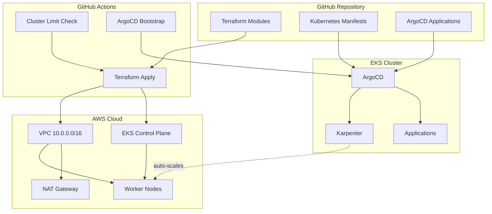

# EKS GitOps Automation

> **Production-ready EKS cluster provisioning with automated GitOps deployment using Terraform, ArgoCD, and Karpenter**

[](https://www.terraform.io/)
[](https://kubernetes.io/)
[](https://aws.amazon.com/eks/)
[](https://argo-cd.readthedocs.io/)

A fully automated platform for deploying production-grade Amazon EKS clusters with GitOps workflows. This project demonstrates modern cloud-native infrastructure automation using Infrastructure as Code (Terraform) and declarative Kubernetes management (Kustomize + ArgoCD).

---

## Features

- **One-Click Deployment** - GitHub Actions workflow for automated cluster provisioning
- **GitOps Native** - ArgoCD manages all applications from Git (no Helm required locally)
- **Modular Terraform** - Reusable modules for VPC, EKS, and node groups
- **Cost Controls** - Built-in 2-cluster limit to prevent runaway AWS costs
- **Auto-Scaling** - Karpenter for intelligent, cost-effective node provisioning
- **Production Ready** - Private subnets, NAT gateway, IAM roles, RBAC
- **Idempotent** - Safely manages existing clusters or creates new ones
- **App-of-Apps Pattern** - Centralized application management via ArgoCD

---

## Architecture



---

## Project Structure

```
eks-gitops-automation/
├── .github/workflows/
│   └── cluster-dispatch.yaml       # Automated deployment workflow
│
├── terraform/
│   ├── infra/                      # Root infrastructure configuration
│   │   ├── main.tf                 # Module orchestration
│   │   ├── provider.tf             # AWS provider setup
│   │   └── variables.tf            # Input variables
│   └── modules/
│       ├── network/                # VPC, subnets, NAT, IGW
│       └── eks/                    # EKS cluster, IAM, node groups
│
├── k8s-apps/
│   ├── argocd/                     # ArgoCD installation (Kustomize)
│   │   └── kustomization.yaml
│   ├── argocd-apps/                # ArgoCD Application CRDs
│   │   ├── apps.yml                # Application registry
│   │   ├── karpenter.yaml          # Karpenter autoscaler
│   │   └── cert-manager.yaml       # TLS certificate manager
│   └── manifests/                  # Application manifests
│       ├── karpenter/
│       └── cert-manager/
│
├── scripts/
│   └── get-argocd-admin-pw.sh      # Retrieve ArgoCD credentials
│
├── README.md                        # This file
├── MANIFEST_GUIDE.md                # Kustomize best practices
└── WORKFLOW_GUIDE.md                # Detailed workflow documentation
```

---

## Quick Start

### Prerequisites

- AWS Account with admin permissions
- GitHub Account
- AWS CLI configured (for local deployments)
- kubectl installed
- Terraform 1.6+ installed


---

## Configuration

### Customize Cluster Settings

Edit `terraform/infra/main.tf`:

```hcl
module "network" {
  source               = "../modules/network"
  eks_cluster_name     = "my-cluster"          # Change cluster name
  vpc_cidr             = "10.0.0.0/16"         # Customize VPC CIDR
  public_subnet_cidrs  = ["10.0.1.0/24", "10.0.2.0/24"]
  private_subnet_cidrs = ["10.0.3.0/24", "10.0.4.0/24"]
  aws_region           = "us-east-1"           # Change region
  azs                  = ["us-east-1a", "us-east-1b"]
}

module "eks" {
  source           = "../modules/eks"
  eks_cluster_name = "my-cluster"
  eks_version      = "1.29"                    # Kubernetes version
  
  node_groups = {
    default = {
      desired_capacity = 3                     # Node count
      max_capacity     = 6
      min_capacity     = 2
      instance_types   = ["t3.medium"]         # Instance type
    }
  }
}
```

### Add New Applications

1. **Create manifests**
   ```bash
   mkdir -p k8s-apps/manifests/my-app
   # Add your Kubernetes YAML files
   ```

2. **Create ArgoCD Application**
   ```yaml
   # k8s-apps/argocd-apps/my-app.yaml
   apiVersion: argoproj.io/v1alpha1
   kind: Application
   metadata:
     name: my-app
     namespace: argocd
   spec:
     project: default
     source:
       repoURL: https://github.com/YOUR_USERNAME/eks-gitops-automation.git
       path: k8s-apps/manifests/my-app
       targetRevision: main
     destination:
       server: https://kubernetes.default.svc
       namespace: my-app
     syncPolicy:
       automated:
         prune: true
         selfHeal: true
       syncOptions:
         - CreateNamespace=true
   ```

3. **Commit and push** - ArgoCD will automatically deploy!

---

## Key Concepts

### GitOps with ArgoCD

This project uses **declarative GitOps** - the Git repository is the single source of truth:

- **Infrastructure**: Managed by Terraform
- **Applications**: Managed by ArgoCD
- **Configuration**: All in Git (no manual `kubectl apply`)

### Kustomize Over Helm

We use **Kustomize** instead of Helm for several reasons:

- No local Helm installation required  
- Native kubectl integration  
- Easier to understand (pure YAML)  
- Better for GitOps workflows  
- ArgoCD has built-in Kustomize support

See [MANIFEST_GUIDE.md](./MANIFEST_GUIDE.md) for detailed patterns and best practices.

### App-of-Apps Pattern

ArgoCD's **app-of-apps** pattern provides centralized management:

```
app-of-apps.yaml (root)
    ├── karpenter.yaml
    ├── cert-manager.yaml
    └── (future apps...)
```

Adding a new application is as simple as creating a new YAML file in `k8s-apps/argocd-apps/`.

### Cluster Limit Enforcement

The GitHub Actions workflow enforces a **maximum of 2 EKS clusters** to prevent accidental cost overruns:

```bash
# Automatically checked before deployment
MAX_CLUSTERS=2
CURRENT=$(aws eks list-clusters --query 'length(clusters)')
if [ $CURRENT -ge $MAX_CLUSTERS ]; then
  echo "Maximum cluster limit reached"
  exit 1
fi
```

---

## Cost Estimation

| Resource | Monthly Cost (us-east-1) |
|----------|--------------------------|
| EKS Control Plane | ~$73 |
| Worker Nodes (2x t3.micro) | ~$15 (free tier eligible) |
| NAT Gateway | ~$32 |
| Data Transfer | ~$5-10 |
| **Total** | **~$120-130/month** |

### Cost Optimization Tips

- **Scale down** when not in use: `kubectl scale deployment --replicas=0`
- **Destroy** test clusters: `terraform destroy`
- **Use Karpenter** to automatically scale nodes based on demand
- **2-cluster limit** prevents runaway costs

---

## Security Features

- **Private Subnets** - Worker nodes in private subnets
- **NAT Gateway** - Secure outbound internet access
- **IAM Roles** - Least privilege access for nodes and pods
- **RBAC** - Kubernetes role-based access control
- **Network Policies** - Pod-to-pod traffic restrictions
- **Secrets Management** - ArgoCD sealed secrets support
- **TLS Certificates** - Automated with cert-manager

---

## Testing & Verification

### Verify Cluster Health

```bash
# Check nodes
kubectl get nodes

# Check all pods
kubectl get pods -A

# Check ArgoCD applications
kubectl get applications -n argocd

# View ArgoCD sync status
kubectl describe application karpenter -n argocd
```

### Test Karpenter Autoscaling

```bash
# Create test deployment
kubectl create deployment inflate \
  --image=public.ecr.aws/eks-distro/kubernetes/pause:3.2 \
  --replicas=0

# Scale up to trigger Karpenter
kubectl scale deployment inflate --replicas=10

# Watch Karpenter provision nodes
kubectl logs -f -n karpenter -l app.kubernetes.io/name=karpenter

# Check new nodes
kubectl get nodes --watch
```

### Access ArgoCD UI

```bash
# Get LoadBalancer URL
kubectl get svc argocd-server -n argocd \
  -o jsonpath='{.status.loadBalancer.ingress[0].hostname}'

# Get admin password
kubectl -n argocd get secret argocd-initial-admin-secret \
  -o jsonpath="{.data.password}" | base64 -d
```

---

## Troubleshooting

### ArgoCD Not Syncing

```bash
# Check application status
kubectl get applications -n argocd

# View detailed sync errors
kubectl describe application <app-name> -n argocd

# Check ArgoCD controller logs
kubectl logs -n argocd -l app.kubernetes.io/name=argocd-application-controller
```

### Karpenter Not Scaling

```bash
# Check Karpenter logs
kubectl logs -n karpenter -l app.kubernetes.io/name=karpenter

# Verify provisioner exists
kubectl get provisioner

# Check for pending pods
kubectl get pods -A | grep Pending
```

### Terraform State Issues

```bash
# If cluster already exists, import it
terraform import module.eks.aws_eks_cluster.this[0] main-eks

# View current state
terraform state list

# Refresh state
terraform refresh
```

---

## Documentation

- **[MANIFEST_GUIDE.md](./MANIFEST_GUIDE.md)** - Kustomize patterns and best practices
- **[WORKFLOW_GUIDE.md](./WORKFLOW_GUIDE.md)** - Detailed GitHub Actions workflow
- **[ArgoCD Docs](https://argo-cd.readthedocs.io/)** - Official ArgoCD documentation
- **[Karpenter Docs](https://karpenter.sh/)** - Karpenter autoscaling guide
- **[AWS EKS Best Practices](https://aws.github.io/aws-eks-best-practices/)** - Production hardening

---

## Use Cases

This project is ideal for:

- **Learning** - Hands-on experience with modern DevOps tools
- **Portfolio** - Demonstrate cloud-native infrastructure skills
- **Development** - Quick EKS cluster for testing applications
- **Production** - Foundation for production-grade deployments

---

## Roadmap

- [x] Terraform EKS provisioning
- [x] GitOps with ArgoCD
- [x] Karpenter autoscaling
- [x] GitHub Actions automation
- [x] Cluster limit enforcement
- [ ] Monitoring with Prometheus/Grafana
- [ ] Logging with EFK stack
- [ ] Service mesh (Istio/Linkerd)
- [ ] Multi-environment support (dev/staging/prod)
- [ ] Terraform remote state (S3 + DynamoDB)

---

## Contributing

This is a portfolio/learning project. Feel free to:

- Fork and customize for your needs
- Report issues
- Suggest improvements
- Star if you find it useful!

---

## License

MIT License - See [LICENSE](./LICENSE) for details

---

## Author

**Eddie** - DevOps Engineer

- Portfolio: [devops-portfolio](https://github.com/YOUR_USERNAME/devops_engineering_portfolio)
- LinkedIn: [Your LinkedIn](https://linkedin.com/in/YOUR_PROFILE)

---

## Acknowledgments

- AWS for EKS and comprehensive documentation
- ArgoCD team for excellent GitOps tooling
- Karpenter team for intelligent autoscaling
- HashiCorp for Terraform
- The Kubernetes community

---

<div align="center">

**Built with love using Terraform, Kubernetes, and GitOps principles**

[⬆ Back to Top](#eks-gitops-automation)

</div>
